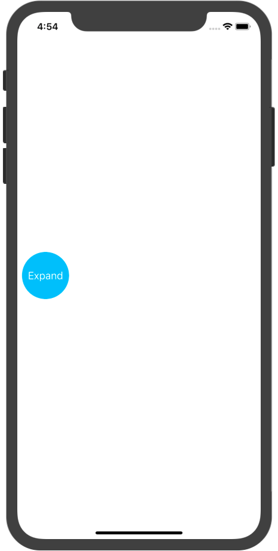
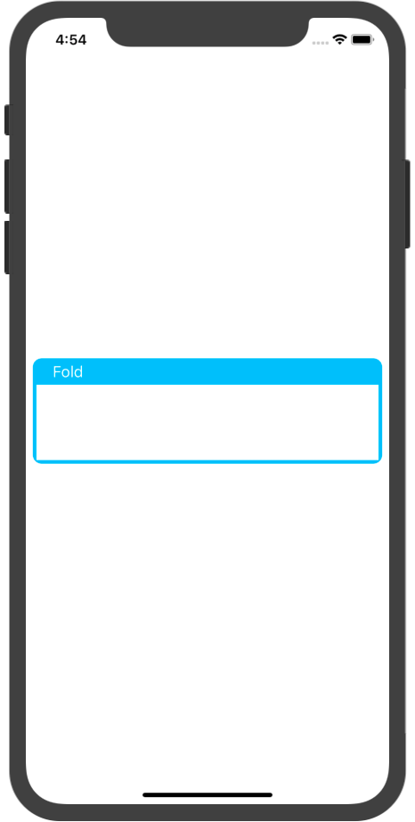
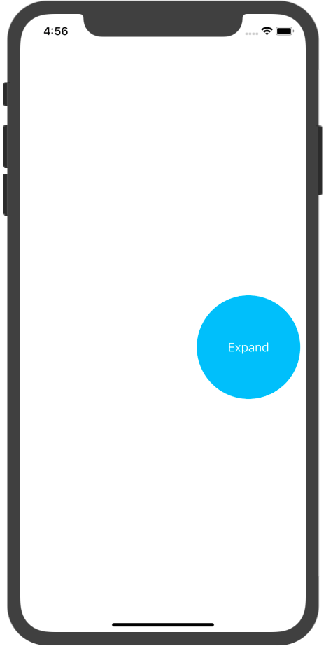
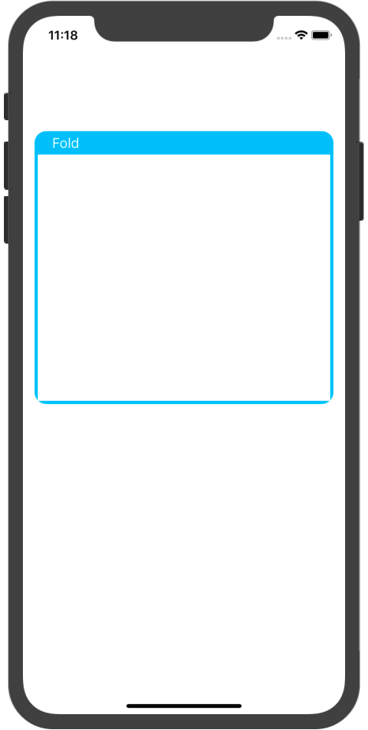
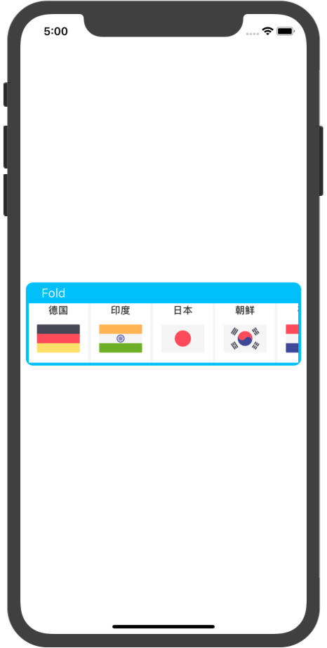
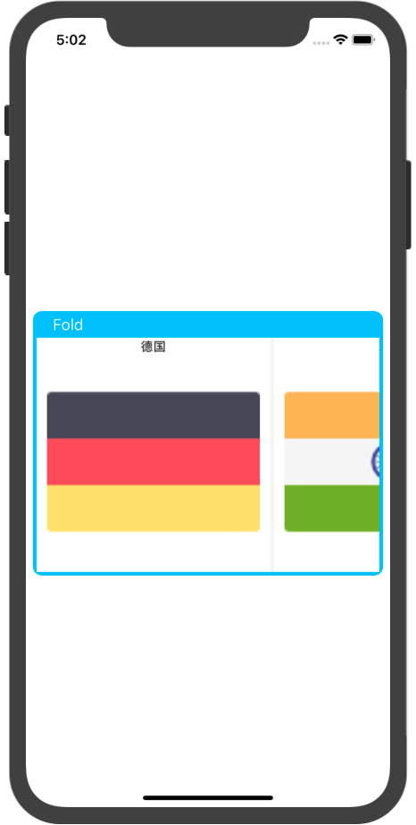
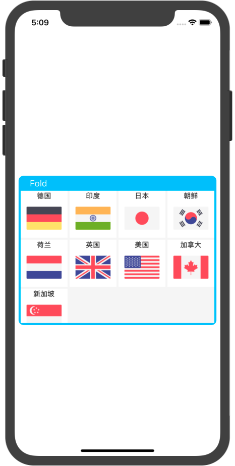

## EView's demo

### Simple EView

```swift
eView = EView.serialization(in: view)
view.addSubview(eView)
```

<div display="block">


</div>

### Custom

```swift
/// Custom config
var config = EViewConfig()
config.located = .right
config.size = CGSize(width: 150, height: 150)
config.expandSize = CGSize(width: view.bounds.width - 16, height: 300)
eView.applyConfig(config)
```

<div display="block">


</div>

### Show datas

```swift
/// Show datas
let datas = [["title": "德国", "image": "GM.png"],
             ["title": "印度", "image": "IN.png"],
             ["title": "日本", "image": "JP.png"],
             ["title": "朝鲜", "image": "SK.png"],
             ["title": "荷兰", "image": "NL.png"],
             ["title": "英国", "image": "UK.png"],
             ["title": "美国", "image": "US.png"],
             ["title": "加拿大", "image": "CA.png"],
             ["title": "新加坡", "image": "SP.png"]]

/// Cell's config
let cellConfig = EViewCellConfig(keys: ["title", "image"])
eView.showDatas(datas, with: cellConfig) { (idx) in
    print("Selected: \(idx)")
}
```

<div display="block">


</div>

### Combine custom with show datas

<div display="block">


</div>

Custom cell's size

```swift
/// Cell's config
let cellConfig = EViewCellConfig(keys: ["title", "image"])
let layout = UICollectionViewFlowLayout()
let wh = (view.bounds.width - 16 - 20) / 4
layout.itemSize = CGSize(width: wh, height: wh)
layout.minimumLineSpacing = 4
layout.minimumInteritemSpacing = 4
cellConfig.layout = layout
eView.showDatas(datas, with: cellConfig) { (idx) in
    print("Selected: \(idx)")
}
```

<div display="block">


</div>