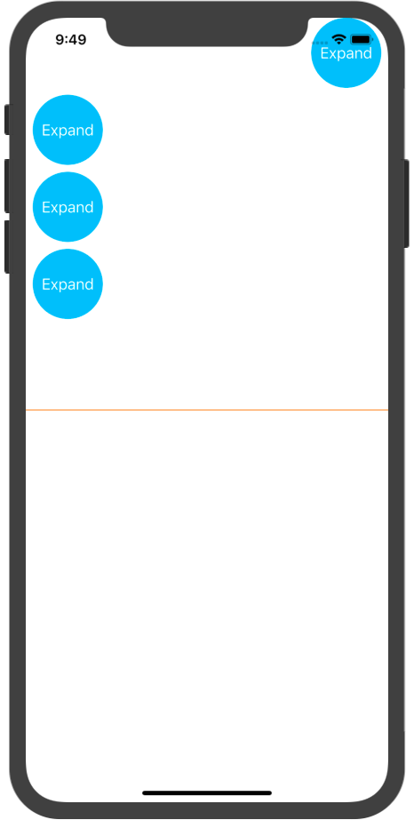
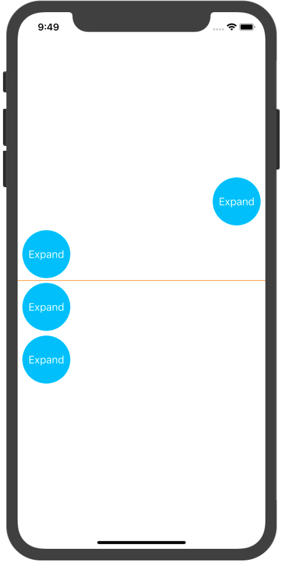
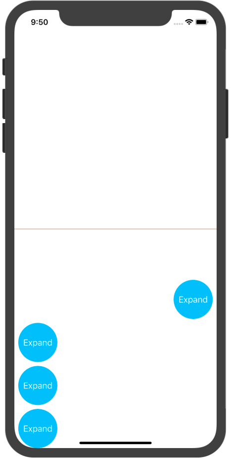
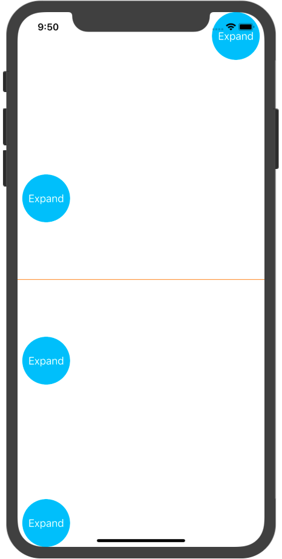
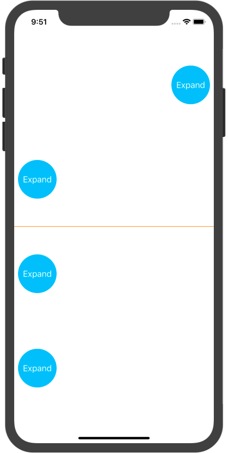

## EViewGroup

**Code**

```swift
/// Init EViews
let view1 = EView.serialization(in: view)
let view2 = EView.serialization(in: view)
let view3 = EView.serialization(in: view)
let view4 = EView.serialization(in: view)

/// Init `global` EViewGroup
eGroup = EViewGroup.init(layout: .start, mode: .clever, with: view1, view2, view3, view4)
eGroup.interItemSpacing = 8
eGroup.formed()

/// Or
eGroup = EViewGroup.init(layout: .start, with: view1, view2, view3, view4)
eGroup.mode = .clever
eGroup.interItemSpacing = 8
eGroup.formed()

/// Or
eGroup = EViewGroup.init(mode: .clever, with: view1, view2, view3, view4)
eGroup.layout = .center
eGroup.interItemSpacing = 8
eGroup.formed()

/// Or 
eGroup = EViewGroup.init(with: view1, view2, view3, view4)
eGroup.layout = .center
eGroup.mode = .clever
eGroup.interItemSpacing = 8
eGroup.formed()
```

**Effect**

`layout = ` `.start` / `.center` / `.end` / `.spaceBetween` / `.spaceAround`

<div display="block">





</div>

Configure `view1` as follow:

```swift
var view1Config = EViewConfig()
view1Config.located = .right
view1Config.expandSize = CGSize.init(width: view.bounds.width - 16, height: 600)
view1.applyConfig(view1Config)
```

And set `eGroup.mode = ` `.one` or `.more` or `.clever`

Try it and see what's different