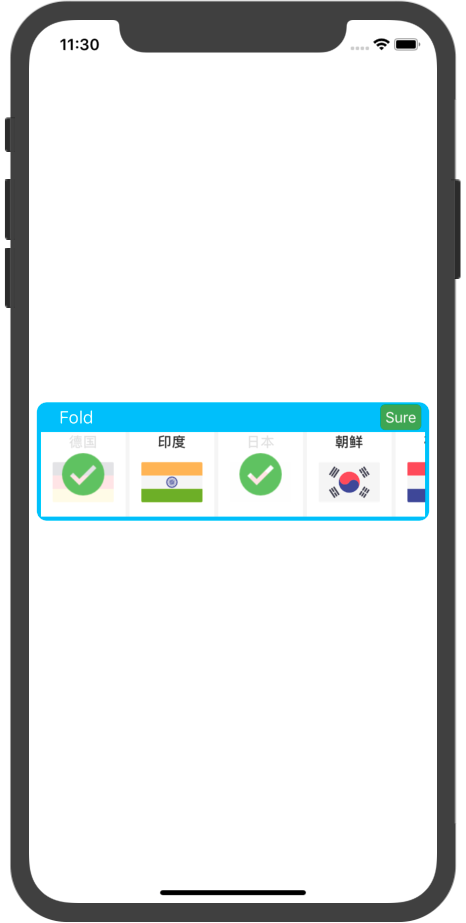
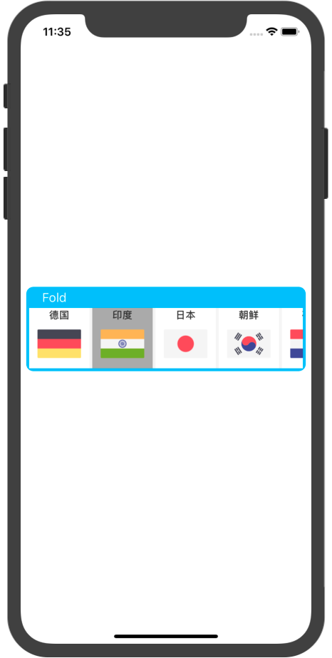
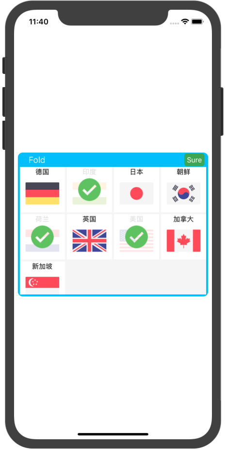

## EView with datas

**Code**

**First [Init EView and configure it](https://github.com/yutingLei/Expander/blob/master/simple-eview-demo.md)**

**Second:** suppose array data as follow

```swift
let datas = [["title": "Gemany", "image": "GM.png"],
            ["title": "India", "image": "IN.png"],
            ["title": "Japan", "image": "JP.png"],
            ["title": "Netherlands", "image": "NL.png"],
            ["title": "UK", "image": "UK.png"],
            ["title": "US", "image": "US.png"],
            ["title": "Canada", "image": "CA.png"],
            ["title": "Singapore", "image": "SP.png"]]
```

**Third:** configure cell

```swift
let cellConfig = EViewCellConfig(keys: ["title", "image"])
```

**Forth:** show datas

```swift
eView.showDatas(datas, with: cellConfig) {idx in
	print("Current selected index = \(idx)")
}
```


**Effects**

<div display="block">

</div>

```swift
cellConfig.isMultiSelect = true
```

<div display="block">

</div>

```swift
cellConfig.isMultiSelect = false
cellConfig.selectedBackgroundColor = .orange
```
<div display="block">

</div>

```swift
/// Combine with EView's configurations
var config = EViewConfig()
config.expandSize = CGSize(width: view.bounds.width - 16, height: 300)
eView.applyConfig(config)

/// Custom cell's layout
cellConfig.isMultiSelect = true
let layout = UICollectionViewFlowLayout()
layout.itemSize = CGSize(width: (view.bounds.width - 16 - 20) / 4, height: (view.bounds.width - 16 - 20) / 4)
layout.minimumLineSpacing = 4
layout.minimumInteritemSpacing = 4
cellConfig.layout = layout
```

<div display="block">

</div>