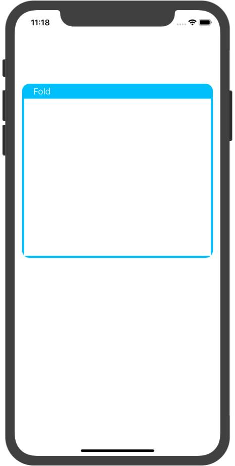

## Simple EView

**Code**

```swift
let eView = EView.serialization(in: view)
view.addSubview(eView)
```

**Effects**

<div display="block">


</div>

## Configurations for EView

**Code**

```swift
/// First method for init
var config = EViewConfig(size: CGSize.init(width: 100, height: 100),
                         expandCornerRadius: 15,
                         padding: EViewPadding.init(0, 15),
                         expandType: .up,
                         located: .right)
config.expandSize = CGSize.init(width: -1, height: 350)
                         
/// Second method for init
// var cofig = EViewConfig()
// config.size = CGSize.init(width: 100, height: 100)
// config.expandCornerRadius = 15
// config.padding = EViewPadding.init(0, 15)
// config.expandType = .up
// config.located = .right
// config.expandSize = CGSize.init(width: -1, height: 350)

/// Apply configuration
eView.applyConfig(config)
```

**Effects**

<div display="block">


</div>